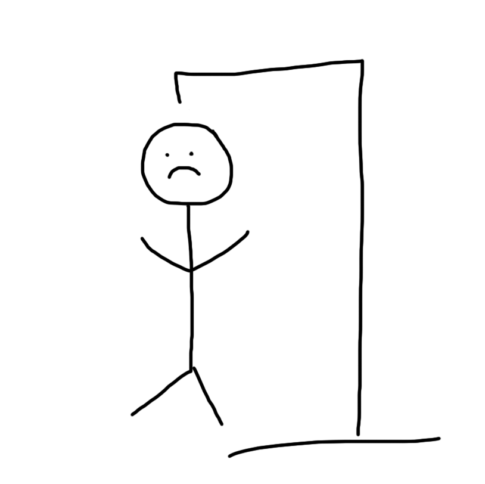

  

Hangman is a game where the user must guess what the random word is by choosing random letters that may be in the word. If the user guesses a letter that is not in the word, the hangman gains a body part. After 6 incorrect guesses, the game is lost.  
